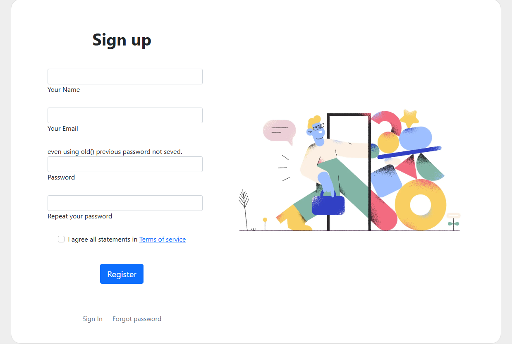
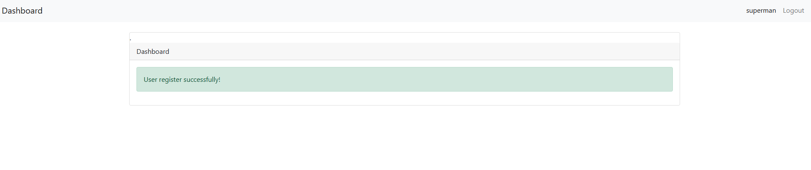
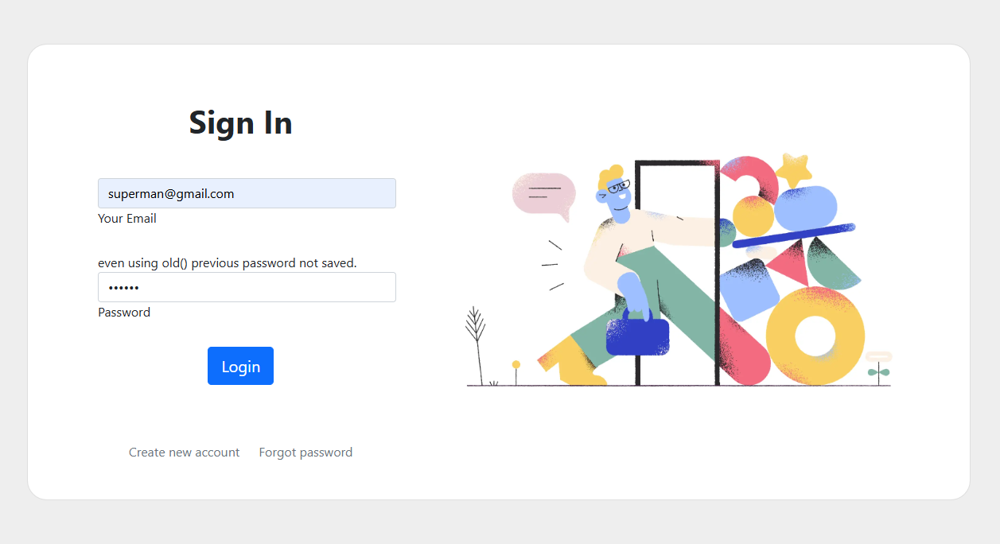
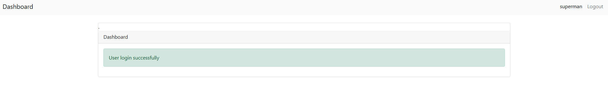
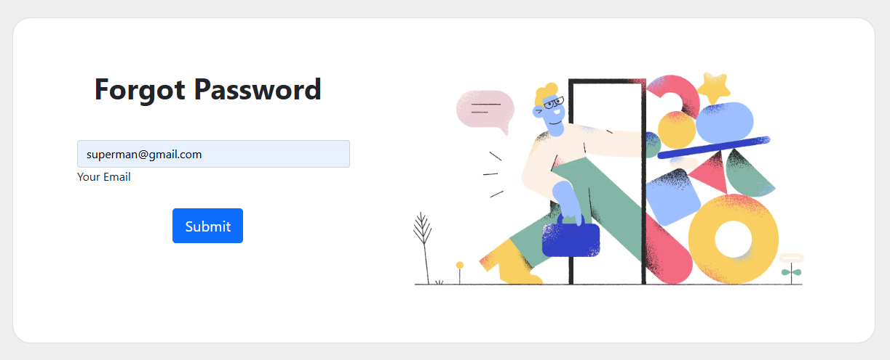
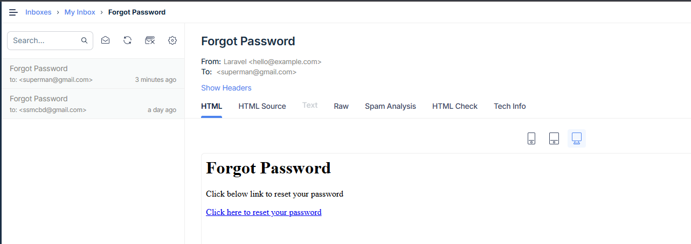
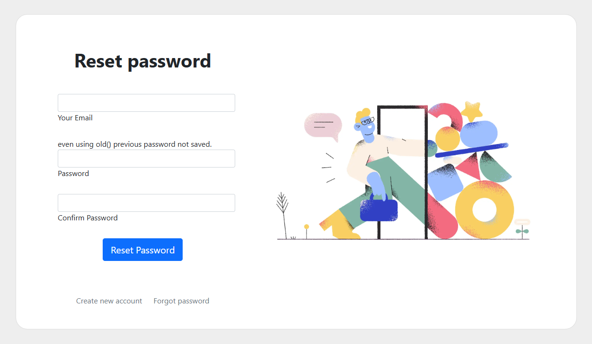
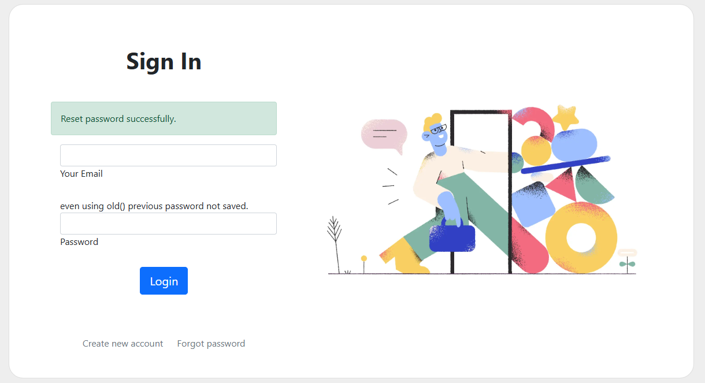

# 🔐 Laravel 10 User Authentication System

This is a simple and clean Laravel 10 project that implements a secure and user-friendly authentication system, including:

- ✅ User Registration
- ✅ Login with session-based auth
- ✅ Forgot Password & Reset via Email
- ✅ Input Validation
- ✅ CSRF Protection


> This project showcases modern Laravel practices suitable for production-ready authentication modules.

---

## 🚀 Features

- Built with **Laravel 10**
- Authentication using Laravel's built-in features
- Secure password reset via email
- Uses Laravel Breeze with Bootstrap 5 CSS for simple UI
- Cleanly structured controllers and views

---

## 📸 Screenshots

| Register Page | Login Page | Reset Password |
|---------------|------------|----------------|
|  |  |  |  |  |  |  |  |

> Screenshots are located in the `/screenshots` folder. Make sure to include them in your repo!

---

## ⚙️ Installation

To run this project locally:

```bash
# Clone the repo
git clone https://github.com/your-username/laravel-auth-system.git
cd laravel-auth-system

# Install PHP dependencies
composer install

# Configure environment
cp .env.example .env
php artisan key:generate

# Set up database
php artisan migrate

# Serve the app
php artisan serve
